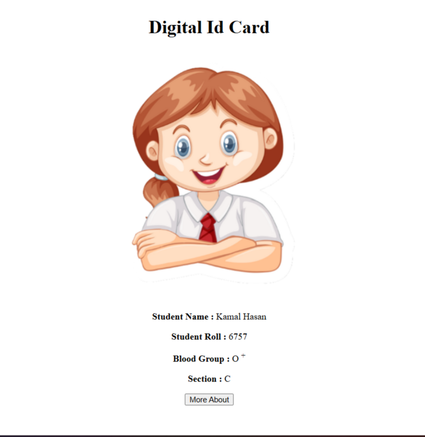

# 🪪 Student ID Card Using HTML

> A clean, responsive, and well-structured student ID card built using only HTML5.

---

## 📸 Project Preview

<p align="center">
  
</p>

---

## 🚀 Live Demo

🔗 **Live Website:**  
https://joni250.github.io/student-id-card-html/

---

## 📂 Repository

🔗 **GitHub Repository:**  
https://github.com/Joni250/student-id-card-html

---

## ✨ Features

- ✅ Clean and responsive layout
- ✅ Semantic HTML5 structure
- ✅ Professional ID card design
- ✅ Student information section
- ✅ Profile image placeholder
- ✅ Simple and beginner-friendly project

---

## 🛠️ Technologies Used

| Technology | Purpose |
|------------|---------|
| HTML5 | Structure and ID card layout |

---

## 📁 Project Structure

```text
student-id-card-html/
│── index.html
│── preview.png
│── README.md
```

---

## 🎯 Project Purpose

This project was created to practice HTML page structure and layout by designing a simple student ID card. It focuses on organizing profile information in a clean and structured format using semantic HTML elements.

---

## 💡 What I Learned

- HTML5 Structure
- Semantic HTML
- Organizing Content
- Profile Card Layout
- Clean Code Organization
- Basic Responsive Design Principles

---

## 👩‍💻 Author

** Mst Joni Khatun**

Aspiring Frontend & WordPress Developer

GitHub:  
https://github.com/Joni250

---

## ⭐ Support

If you found this project helpful, please consider giving it a ⭐ on GitHub.
